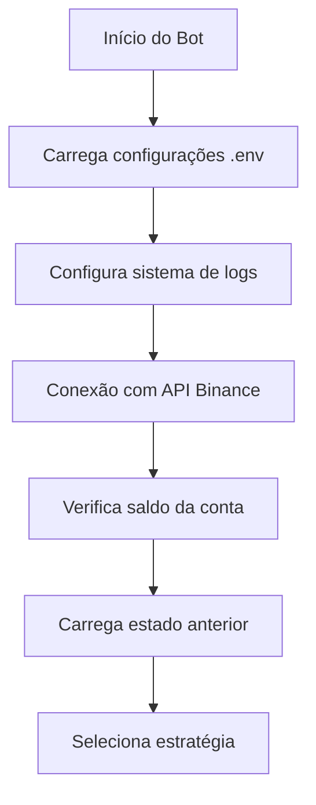
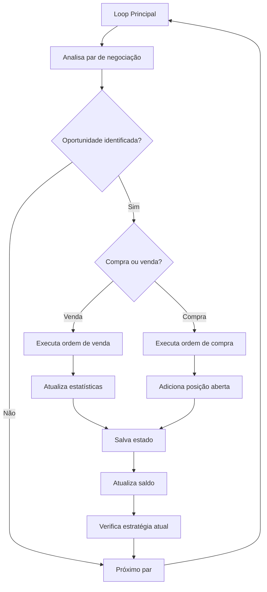

# Robot-Crypt: Guia de Funcionamento

Este documento explica em detalhes como o Robot-Crypt funciona, sua arquitetura, fluxo de operações e recursos disponíveis.

## Visão Geral

Robot-Crypt é um sistema de trading automatizado para a Binance que executa estratégias de negociação com suporte para múltiplas moedas (BNB, USDT, BRL) e utiliza diferentes abordagens dependendo do tamanho do capital.

## Arquitetura do Sistema

O sistema é composto pelos seguintes módulos:

### Módulos Principais

- **main.py**: Ponto de entrada principal que coordena todo o fluxo de operação
- **binance_api.py**: Integração com a API da Binance para operações reais
- **strategy.py**: Implementação das estratégias de trading (Scalping e Swing Trading)
- **config.py**: Gerenciamento de configurações e parâmetros
- **utils.py**: Funções auxiliares, cálculos e persistência de estado
- **telegram_notifier.py**: Envio de notificações via Telegram

### Módulos Auxiliares

- **binance_simulator.py**: Simulação da API da Binance para testes
- **setup_*.sh**: Scripts para configuração de diferentes ambientes

## Fluxo de Operação

### 1. Inicialização



- O bot inicia carregando as configurações do arquivo `.env`
- Configura o sistema de logs (salvos em `/logs`)
- Conecta-se à API da Binance (modo real, TestNet, ou simulação)
- Verifica o saldo da conta (BNB, USDT, BRL)
- Carrega o estado anterior se existir (para retomar operações interrompidas)

### 2. Seleção de Estratégia

O bot escolhe automaticamente entre duas estratégias com base no capital:

- **Scalping** (para capital < R$300): 
  - Operações rápidas com lucros menores (1-2%)
  - Menor exposição ao risco
  - Intervalo de análise curto
  - Horizonte de negociação: minutos/horas

- **Swing Trading** (para capital >= R$300): 
  - Operações de médio prazo com lucros maiores (3-8%)
  - Tolerância maior para volatilidade
  - Maior tempo de retenção de posições
  - Horizonte de negociação: horas/dias

### 3. Seleção de Pares de Negociação

O bot seleciona pares de negociação com base nas moedas disponíveis na conta:

- **Para BNB**: BNB/USDT, BNB/BTC, BNB/BRL
- **Para USDT**: BTC/USDT, ETH/USDT, DOGE/USDT, SHIB/USDT, FLOKI/USDT
- **Para BRL**: BTC/BRL, ETH/BRL, DOGE/BRL

A seleção também considera o ambiente de execução (real ou TestNet) e filtra pares indisponíveis.

### 4. Ciclo de Trading



Para cada par selecionado, o bot:

1. **Analisa o mercado**:
   - Coleta dados históricos de preços
   - Calcula indicadores técnicos
   - Avalia volumes de negociação
   - Identifica tendências e padrões

2. **Toma decisões**:
   - Decide se deve comprar, vender ou aguardar
   - Calcula níveis de entrada e saída
   - Define stop loss e take profit

3. **Executa ordens**:
   - Envia ordens para a Binance quando identifica oportunidades
   - Monitora status das ordens

4. **Gerencia risco**:
   - Limita a exposição conforme configurações (2% por operação por padrão)
   - Distribui capital entre diferentes moedas
   - Define quantidade adequada para negociação

5. **Acompanha posições**:
   - Monitora operações abertas
   - Verifica condições para fechamento (lucro ou prejuízo)
   - Aplica técnicas de trailing stop quando apropriado

### 5. Persistência e Resiliência

O bot implementa mecanismos de persistência para garantir robustez:

- **Salvamento de estado**: 
  - Salva estado em arquivos JSON no diretório `/data`
  - Registra todas as posições abertas
  - Armazena estatísticas e métricas de desempenho

- **Recuperação**:
  - Ao reiniciar, carrega estado anterior
  - Retoma monitoramento de operações abertas
  - Mantém histórico de decisões e resultados

- **Tratamento de erros**:
  - Detecta e lida com falhas na API
  - Remove automaticamente pares indisponíveis
  - Implementa mecanismos de retry para operações falhas

### 6. Notificações

Sistema de notificação via Telegram para manter o usuário informado:

- **Inicialização**: Aviso quando o bot inicia
- **Análise**: Notifica pares sendo analisados
- **Trades**: Informa quando compras e vendas são executadas
- **Resultados**: Comunica lucros e perdas de operações
- **Erros**: Alerta sobre problemas encontrados
- **Relatórios**: Envia resumos diários de desempenho

## Recursos Avançados

### Gerenciamento de BNB

Para contas com saldo em BNB, o bot implementa funcionalidades especiais:

- **Alocação adaptativa**: 
  - Para saldos muito pequenos (<0.035 BNB): 0.001 BNB por operação
  - Para saldos pequenos (<0.05 BNB): 0.002 BNB por operação
  - Para saldos médios (<0.1 BNB): 0.005 BNB por operação
  - Para saldos maiores: 0.01 BNB por operação

- **Economia de taxas**: 
  - Usa BNB para pagar taxas na Binance (desconto de 15-25%)
  - Reserva parte do saldo específicamente para taxas

- **Pares de negociação**: 
  - Prioriza pares com BNB quando há saldo disponível
  - Inclui BNB/USDT para maximizar a utilidade dos saldos BNB e USDT

### Adaptação a Diferentes Mercados

O bot ajusta seu comportamento conforme condições de mercado:

- **Mercado em alta**: Favorece posições longas e estratégias de momentum
- **Mercado em baixa**: Aumenta critérios para entrada e diminui tempo de retenção
- **Mercado lateral**: Ajusta para operações de range trading

## Configuração e Customização

O sistema pode ser personalizado através do arquivo `.env` com configurações como:

```bash
# Credenciais da API Binance
BINANCE_API_KEY=SUA_API_KEY_AQUI
BINANCE_API_SECRET=SUA_API_SECRET_AQUI

# Configuração do ambiente
SIMULATION_MODE=false
USE_TESTNET=false

# Configurações do Telegram
TELEGRAM_BOT_TOKEN=SEU_BOT_TOKEN_AQUI
TELEGRAM_CHAT_ID=SEU_CHAT_ID_AQUI

# Configurações de trading
TRADE_AMOUNT=0.01          # Valor em BNB por operação
TAKE_PROFIT_PERCENTAGE=1.5  # Alvo de lucro em porcentagem
STOP_LOSS_PERCENTAGE=0.8   # Limite de perda em porcentagem
MAX_HOLD_TIME=48           # Tempo máximo de retenção em horas
CHECK_INTERVAL=300         # Intervalo entre verificações em segundos

# Configurações de moedas
PRIMARY_COIN=BNB           # Sua moeda principal para trading
```

## Execução em Docker

O sistema pode ser executado em contêiner Docker, oferecendo:

- **Isolamento**: Ambiente controlado e independente
- **Portabilidade**: Execução uniforme em qualquer sistema com Docker
- **Persistência**: Volumes para manter dados entre execuções
- **Automação**: Integração fácil com CI/CD e orquestração

O arquivo `Dockerfile` configura:
- Imagem base Python 3.9
- Instalação de dependências
- Persistência de logs
- Ambiente não-bufferizado para logs em tempo real

## Diretórios e Arquivos Importantes

- **/logs**: Armazena logs de execução
- **/data**: Armazena arquivos de estado e persistência
- **/.env**: Configurações principais
- **/.env.real**: Configurações para ambiente real

## Estratégias Implementadas

### Scalping (Capital < R$300)

Estratégia focada em:
- Operações rápidas
- Baixo risco por trade (0.5-1%)
- Lucros pequenos mas frequentes
- Indicadores de curto prazo (RSI, MACD)

### Swing Trading (Capital >= R$300)

Estratégia focada em:
- Operações de médio prazo
- Tolerância maior (stops 3%)
- Lucros maiores (alvos 5-8%)
- Análise técnica mais aprofundada
- Indicadores de tendência e volume

## Ciclo de Vida de Um Trade

1. **Identificação**: Bot localiza oportunidade via indicadores técnicos
2. **Validação**: Múltiplos critérios são verificados (volume, tendência)
3. **Entrada**: Ordem de compra enviada com tamanho calculado pelo gerenciador de risco
4. **Monitoramento**: Posição é acompanhada continuamente
5. **Saída**: Ordem de venda executada quando:
   - Alvo de lucro é atingido
   - Stop loss é acionado
   - Tempo máximo de retenção expira

## Conclusão

O Robot-Crypt oferece uma solução completa e robusta para trading automatizado na Binance, com suporte a diversas moedas e estratégias adaptativas. A arquitetura modular permite fácil manutenção e extensão, enquanto os mecanismos de resiliência garantem operação contínua mesmo em condições adversas.
