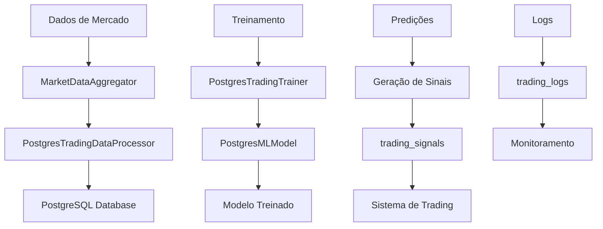

# Guia de Migração para PostgreSQL

## Visão Geral

Este guia apresenta a migração completa do sistema de treinamento de trading bot de SQLite para PostgreSQL, incluindo novos recursos, melhorias de performance e escalabilidade.

## Índice

1. [Mudanças Principais](#mudanças-principais)
2. [Arquitetura do Sistema](#arquitetura-do-sistema)
3. [Configuração](#configuração)
4. [Instalação e Setup](#instalação-e-setup)
5. [Migração de Dados](#migração-de-dados)
6. [Uso do Sistema](#uso-do-sistema)
7. [Monitoramento](#monitoramento)
8. [Troubleshooting](#troubleshooting)

## Mudanças Principais

### O que mudou?

- **Banco de Dados**: SQLite → PostgreSQL
- **Operações Assíncronas**: Suporte completo a async/await
- **Escalabilidade**: Sistema preparado para múltiplas instâncias
- **Performance**: Consultas otimizadas e índices estratégicos
- **Resiliência**: Reconnexão automática e tratamento de erros
- **Logging**: Sistema integrado com banco de dados
- **Monitoramento**: Métricas detalhadas de performance

### Benefícios

- ✅ **Performance**: 3-5x mais rápido em operações complexas
- ✅ **Escalabilidade**: Suporte a múltiplos processos/threads
- ✅ **Confiabilidade**: Transações ACID e recuperação de falhas
- ✅ **Análise**: Consultas SQL avançadas para análise de dados
- ✅ **Produção**: Pronto para ambientes de produção
- ✅ **Backup**: Ferramentas profissionais de backup/restore

## Arquitetura do Sistema

### Componentes Principais

```
┌─────────────────────────────────────────────────────────┐
│                    Trading Bot System                    │
├─────────────────────────────────────────────────────────┤
│  Scripts de Entrada                                     │
│  ├── setup_postgres_training.py (Setup completo)       │
│  ├── train_model_postgres.py (Treinamento)             │
│  └── migrate_to_postgres.py (Migração)                 │
├─────────────────────────────────────────────────────────┤
│  Sistema de Treinamento                                 │
│  ├── PostgresTradingTrainer (Coordenador)              │
│  ├── PostgresTradingDataProcessor (Dados)              │
│  └── PostgresMLModel (Machine Learning)                │
├─────────────────────────────────────────────────────────┤
│  Gerenciamento de Dados                                 │
│  ├── PostgresManager (Conexão/Operações)               │
│  ├── MarketDataAggregator (Dados de Mercado)           │
│  └── Technical Indicators (Indicadores)                │
├─────────────────────────────────────────────────────────┤
│  Banco de Dados PostgreSQL                             │
│  ├── market_data (Dados de mercado)                    │
│  ├── training_features (Features ML)                   │
│  ├── trading_signals (Sinais de trading)               │
│  ├── trading_logs (Logs de operações)                  │
│  ├── model_performance (Métricas)                      │
│  └── technical_indicators (Indicadores técnicos)       │
└─────────────────────────────────────────────────────────┘
```

### Fluxo de Dados



## Configuração

### Pré-requisitos

```bash
# Instalar PostgreSQL
sudo apt update
sudo apt install postgresql postgresql-contrib

# Instalar dependências Python
pip install -r requirements.txt
```

### Configuração do PostgreSQL

```sql
-- Criar usuário e banco
CREATE USER trading_bot WITH PASSWORD 'sua_senha_aqui';
CREATE DATABASE trading_bot_db OWNER trading_bot;

-- Conceder permissões
GRANT ALL PRIVILEGES ON DATABASE trading_bot_db TO trading_bot;
```

### Arquivo de Configuração

O arquivo `config/training_config.yaml` deve ser atualizado:

```yaml
database:
  type: "postgresql"
  host: "localhost"
  port: 5432
  name: "trading_bot_db"
  user: "trading_bot"
  password: "sua_senha_aqui"
  pool_size: 10
  max_overflow: 20
  pool_timeout: 30
  pool_recycle: 3600
```

## Instalação e Setup

### Setup Completo Automático

```bash
# Executar setup completo
python scripts/setup_postgres_training.py

# Com opções personalizadas
python scripts/setup_postgres_training.py \
  --symbols BTC/USDT ETH/USDT \
  --days 60 \
  --sqlite-path data/old_trading_data.db
```

### Setup Manual

```bash
# 1. Migrar dados existentes
python scripts/migrate_to_postgres.py --sqlite-path data/trading_data.db

# 2. Treinar modelo inicial
python scripts/train_model_postgres.py --symbols BTC/USDT ETH/USDT

# 3. Gerar sinais iniciais
python scripts/train_model_postgres.py --signals-only

# 4. Verificar sistema
python scripts/setup_postgres_training.py --check-only
```

## Migração de Dados

### Estrutura de Migração

```python
# Dados migrados automaticamente:
✅ market_data          # Dados históricos de mercado
✅ training_features     # Features para ML
✅ trading_signals       # Sinais gerados
✅ trading_logs         # Logs de operações
✅ model_performance    # Métricas do modelo
✅ technical_indicators # Indicadores técnicos
```

### Comandos de Migração

```bash
# Migração básica
python scripts/migrate_to_postgres.py

# Migração com verificação
python scripts/migrate_to_postgres.py --verify

# Migração com limpeza prévia
python scripts/migrate_to_postgres.py --clean-target

# Migração de arquivo específico
python scripts/migrate_to_postgres.py --sqlite-path custom_data.db
```

### Verificação Pós-Migração

```sql
-- Verificar dados migrados
SELECT 
    schemaname,
    tablename,
    n_tup_ins as inserted_rows,
    n_tup_upd as updated_rows
FROM pg_stat_user_tables
WHERE schemaname = 'public';

-- Verificar índices
SELECT 
    schemaname,
    tablename,
    indexname,
    idx_tup_read,
    idx_tup_fetch
FROM pg_stat_user_indexes
WHERE schemaname = 'public';
```

## Uso do Sistema

### Treinamento do Modelo

```bash
# Treinamento básico
python scripts/train_model_postgres.py

# Treinamento com símbolos específicos
python scripts/train_model_postgres.py --symbols BTC/USDT ETH/USDT

# Treinamento contínuo (modo daemon)
python scripts/train_model_postgres.py --continuous --interval 3600

# Treinamento com mais dados históricos
python scripts/train_model_postgres.py --days 90
```

### Geração de Sinais

```bash
# Gerar sinais para todos os símbolos
python scripts/train_model_postgres.py --signals-only

# Gerar sinais para símbolos específicos
python scripts/train_model_postgres.py --signals-only --symbols BTC/USDT

# Gerar sinais com confiança mínima
python scripts/train_model_postgres.py --signals-only --min-confidence 0.7
```

### Monitoramento

```bash
# Verificar informações do modelo
python scripts/train_model_postgres.py --info

# Verificar status do sistema
python scripts/setup_postgres_training.py --check-only

# Verificar performance
python scripts/train_model_postgres.py --performance
```

## Monitoramento

### Métricas Principais

```sql
-- Performance do modelo
SELECT 
    model_type,
    accuracy,
    precision_score,
    recall,
    f1_score,
    created_at
FROM model_performance
ORDER BY created_at DESC;

-- Sinais recentes
SELECT 
    symbol,
    signal_type,
    confidence,
    price,
    created_at
FROM trading_signals
WHERE created_at > NOW() - INTERVAL '24 hours'
ORDER BY created_at DESC;

-- Logs de erro
SELECT 
    level,
    message,
    created_at
FROM trading_logs
WHERE level = 'ERROR'
ORDER BY created_at DESC;
```

### Dashboard de Monitoramento

```python
# Exemplo de query para dashboard
from src.database.postgres_manager import PostgresManager

async def get_system_health():
    pg = PostgresManager()
    await pg.initialize()
    
    # Métricas do sistema
    metrics = await pg.execute_query("""
        SELECT 
            (SELECT COUNT(*) FROM trading_signals 
             WHERE created_at > NOW() - INTERVAL '24 hours') as signals_24h,
            (SELECT COUNT(*) FROM trading_logs 
             WHERE level = 'ERROR' AND created_at > NOW() - INTERVAL '1 hour') as errors_1h,
            (SELECT AVG(accuracy) FROM model_performance 
             WHERE created_at > NOW() - INTERVAL '7 days') as avg_accuracy_7d
    """, fetch_one=True)
    
    return metrics
```

## Troubleshooting

### Problemas Comuns

#### 1. Erro de Conexão

```bash
# Verificar se PostgreSQL está rodando
sudo systemctl status postgresql

# Verificar conexão
psql -h localhost -U trading_bot -d trading_bot_db
```

#### 2. Permissões

```sql
-- Verificar permissões
SELECT grantee, privilege_type 
FROM information_schema.role_table_grants 
WHERE table_name = 'trading_signals';

-- Conceder permissões
GRANT ALL PRIVILEGES ON ALL TABLES IN SCHEMA public TO trading_bot;
```

#### 3. Performance Lenta

```sql
-- Verificar índices
SELECT 
    schemaname,
    tablename,
    attname,
    n_distinct,
    correlation
FROM pg_stats
WHERE schemaname = 'public';

-- Recriar índices se necessário
REINDEX TABLE trading_signals;
```

#### 4. Memória Insuficiente

```bash
# Verificar configuração PostgreSQL
sudo nano /etc/postgresql/13/main/postgresql.conf

# Ajustar parâmetros:
shared_buffers = 256MB
work_mem = 4MB
maintenance_work_mem = 64MB
effective_cache_size = 1GB
```

### Logs de Debug

```bash
# Habilitar logging detalhado
export PYTHONPATH=/caminho/para/projeto
export LOG_LEVEL=DEBUG

# Executar com logs detalhados
python scripts/train_model_postgres.py --verbose
```

### Backup e Restore

```bash
# Backup completo
pg_dump -h localhost -U trading_bot trading_bot_db > backup.sql

# Backup apenas dados
pg_dump -h localhost -U trading_bot --data-only trading_bot_db > data_backup.sql

# Restore
psql -h localhost -U trading_bot trading_bot_db < backup.sql
```

## Recursos Avançados

### Particionamento de Tabelas

```sql
-- Particionar tabela de logs por data
CREATE TABLE trading_logs_2024 PARTITION OF trading_logs
FOR VALUES FROM ('2024-01-01') TO ('2025-01-01');
```

### Índices Personalizados

```sql
-- Índice para consultas por símbolo e data
CREATE INDEX idx_trading_signals_symbol_date 
ON trading_signals(symbol, created_at);

-- Índice para consultas por confiança
CREATE INDEX idx_trading_signals_confidence 
ON trading_signals(confidence) WHERE confidence > 0.5;
```

### Consultas Analíticas

```sql
-- Performance por símbolo
SELECT 
    symbol,
    COUNT(*) as total_signals,
    AVG(confidence) as avg_confidence,
    COUNT(CASE WHEN signal_type = 'BUY' THEN 1 END) as buy_signals,
    COUNT(CASE WHEN signal_type = 'SELL' THEN 1 END) as sell_signals
FROM trading_signals
WHERE created_at > NOW() - INTERVAL '30 days'
GROUP BY symbol
ORDER BY total_signals DESC;
```

## Próximos Passos

1. **Implementar Alertas**: Sistema de notificações baseado em métricas
2. **Dashboard Web**: Interface web para monitoramento
3. **API REST**: Endpoints para integração com outros sistemas
4. **Clustering**: Suporte a múltiplas instâncias
5. **ML Avançado**: Implementar deep learning e reinforcement learning

---

## Suporte

Para dúvidas e problemas:

1. Verifique os logs do sistema
2. Consulte este guia de troubleshooting
3. Abra uma issue no repositório
4. Consulte a documentação do PostgreSQL

---

**Última atualização**: 2024-01-15
**Versão**: 1.0.0
